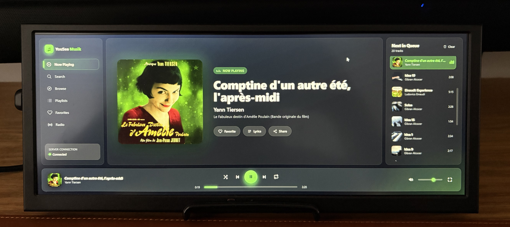

# YouSee Musik Controller

A modern, touch-optimized music controller web application designed for **12" landscape touchscreens**. Built with Go and HTMX, it provides real-time playback control for the **YouSee Musik** streaming service with a responsive, glass-morphism UI.



## Overview

The application features a clean separation of concerns with a Go backend serving an HTMX + Tailwind CSS interface. All playback state is managed server-side and synchronized to clients in real-time via WebSockets, ensuring a single source of truth and simplifying the client architecture.

### Key Features

- **Server-side state management** – All playback logic lives in Go, eliminating complexity on the client
- **Real-time synchronization** – WebSocket-powered updates keep the UI in sync across all devices
- **Demo mode** – Full UI testing without credentials; mock data pre-loaded
- **Responsive design** – Optimized for touchscreen interaction with modern CSS
- **REST API** – Comprehensive endpoints for all playback controls

## Architecture

```
cmd/server              Application entrypoint
internal/
  ├── models            Domain types (Track, Album, Playlist, PlayerState…)
  ├── service           MusicService abstraction
  │   └── yousee        YouSee Musik GraphQL client + auth flow
  ├── player            Authoritative playback state (single source of truth)
  ├── websocket         Real-time event hub
  └── handlers          REST API + HTMX handlers + templating
web/
  ├── templates         Layouts and partials (html/template)
  └── static
      ├── css           Styling (Tailwind + DaisyUI)
      └── js            Client-side interactivity
Dockerfile              Multi-stage build → distroless runtime image
```

### Design Principles

- **Go is the single source of truth** – All playback state (current track, queue, position, volume, shuffle/repeat) lives in the `player` module
- **HTMX for dynamic updates** – Server renders HTML fragments for navigation, search, playlists, queue, and dialogs
- **Event-driven synchronization** – WebSocket events push state changes (`PlaybackStateChanged`, `TrackChanged`, `ProgressUpdated`, `QueueChanged`, `VolumeChanged`, `ConnectionStateChanged`)
- **Client simplicity** – The browser updates only affected DOM elements; no business logic on the client

## Requirements

- **Go** 1.20 or later
- **Docker** (optional, for running the app in a container)
- **YouSee Musik account** (optional for demo mode)

## Building

### Build the application

```bash
go build -o exec/server ./cmd/server
```

This creates a `server` executable in the `exec/` directory. Built binaries are excluded from version control.

### Development build (with hot reload)

For development, you can run the server directly:

```bash
go run ./cmd/server
```

### Build with Docker

The application also ships with a multi-stage `Dockerfile` that produces a small, static binary running on a [Google Distroless](https://github.com/GoogleContainerTools/distroless) base image (`gcr.io/distroless/static-debian12:nonroot`) — no shell, package manager, or other OS tooling, which keeps the image small and reduces its attack surface.

```bash
docker build -t yousee-musik-controller .
```

## Running

### Demo mode (no credentials required)

```bash
go run ./cmd/server
```

The application starts in demo mode with sample music data, allowing you to explore the full UI without authentication.

### With YouSee Musik credentials

```bash
YOUSEE_USERNAME="username" YOUSEE_PASSWORD="secret" go run ./cmd/server
```

Replace the credentials with your YouSee Musik account details. In this mode, real audio playback (HLS streaming) is enabled.

### Running with Docker

```bash
# Demo mode
docker run --rm -p 8080:8080 yousee-musik-controller

# With YouSee Musik credentials
docker run --rm -p 8080:8080 \
  -e YOUSEE_USERNAME="username" \
  -e YOUSEE_PASSWORD="secret" \
  yousee-musik-controller
```

The container listens on port `8080` and runs as the non-root `nonroot` user provided by the distroless base image.

### Configuration

| Environment Variable | Default | Description |
| -------------------- | ------- | ----------- |
| `YOUSEE_ADDR`        | `:8080` | Server listen address |
| `YOUSEE_USERNAME`    | (empty) | YouSee Musik username |
| `YOUSEE_PASSWORD`    | (empty) | YouSee Musik password |

Once running, open <http://localhost:8080> in your browser (or adjust the address based on `YOUSEE_ADDR`).

## REST API (selected)

| Method | Path                         | Purpose                     |
| ------ | ---------------------------- | --------------------------- |
| GET    | `/api/player`                | Current player state (JSON) |
| GET    | `/api/queue`                 | Current queue (JSON)        |
| POST   | `/api/toggle`                | Play / pause                |
| POST   | `/api/next` `/api/previous`  | Skip                        |
| POST   | `/api/seek`                  | `{ "positionMs": n }`       |
| POST   | `/api/volume`                | `{ "volume": 0-100 }`       |
| POST   | `/api/mute`                  | Toggle mute                 |
| POST   | `/api/shuffle` `/api/repeat` | Modes                       |
| POST   | `/api/play/track/{id}`       | Play a single track         |
| POST   | `/api/play/{ctx}/{id}`       | Play album/playlist/artist… |
| POST   | `/api/queue/index/{i}`       | Jump to queue position      |
| POST   | `/api/queue/add/track/{id}`  | Enqueue a track             |
| POST   | `/api/queue/clear`           | Clear the queue             |

WebSocket endpoint: `GET /ws`.

## Dependencies

Key external libraries:

- **HTMX** – Dynamic HTML over the wire (loaded from CDN)
- **Tailwind CSS + DaisyUI** – Utility-first CSS framework (loaded from CDN)
- **hls.js** – HLS video/audio playback (loaded from CDN)

All Go dependencies are specified in `go.mod`.

## Development

### Project structure

- `cmd/server/` – Application entrypoint and main server setup
- `internal/models/` – Domain types and data structures
- `internal/service/` – Business logic and external service integration
- `internal/handlers/` – HTTP route handlers and template rendering
- `internal/websocket/` – Real-time event distribution
- `internal/player/` – Playback state management
- `web/templates/` – HTML templates (server-side rendering)
- `web/static/` – CSS, JavaScript, and images
- `Dockerfile` – Multi-stage build producing a distroless container image

## License

This project is licensed under the [MIT License](LICENSE).

## Contributing

Contributions are welcome! Please feel free to submit pull requests or open issues for bugs and feature requests.

## Support

For issues, questions, or feature requests, please open an issue on the project repository.